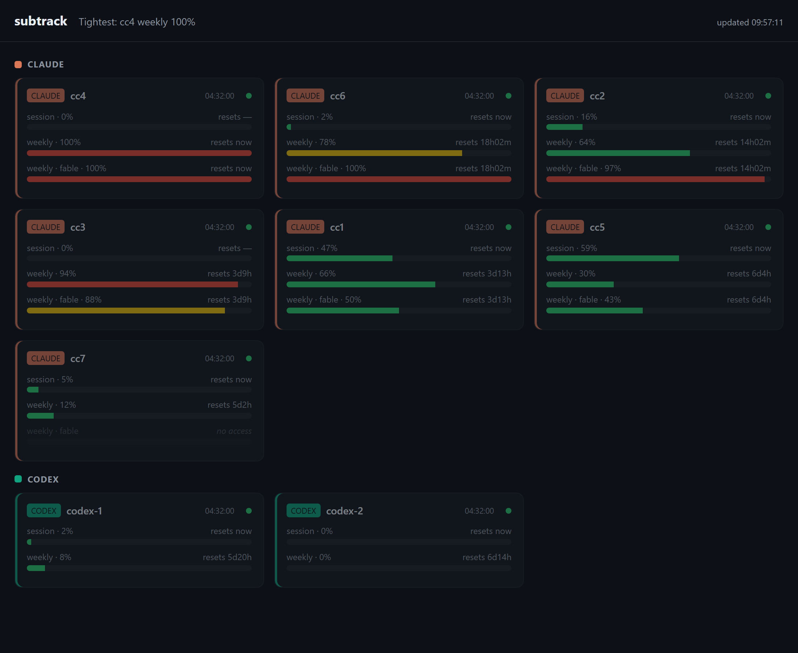

# subtrack

subtrack is a local dashboard for one person who runs many Claude Code and Codex windows at the same time on several paid subscriptions. Each Claude and Codex subscription has a five-hour limit and a weekly limit; a SuperGrok subscription has a two-hour limit for grok-4 and a weekly limit. The agent windows use these limits up at different speeds, and subtrack exists so you can see, before starting a task, which account still has room. It checks every account every one to three minutes and shows on one page how much of each limit is left. It shows which local sessions used up an account's five-hour limit. It also lists every Claude window open in [herdr](https://github.com/herdrdev/herdr) (the terminal workspace manager that hosts the agent windows), with what it is doing and how long it has been idle. It runs on Windows, listens on 127.0.0.1 only and keeps no history database.

The screenshot below is the author's own setup, seven Claude and two Codex subscriptions on one screen. It was taken on 8 July 2026, before the tab bar and the sort by nearest weekly reset were added. subtrack has been in use on the author's machine since its first commit on 29 June 2026.



## What it does

- **Usage tab.** One card per account with the five-hour limit (two hours for grok-4) and the weekly limit as percentage bars and reset countdowns; Claude cards add the separate weekly limits for the Opus and Fable models when the provider reports them. Cards are grouped by provider and sorted so the account with the nearest weekly reset comes first, and the header names the account and limit with the highest use. A rate-limited account waits as long as the provider's `Retry-After` asks, up to 60 minutes, says so on the card and keeps the last real numbers visible.
- **Which sessions used up the five-hour limit.** Click the five-hour bar of a Codex card, or of a Claude card registered with `--readonly-home` (the Claude home your work actually runs in), and subtrack lists the sessions that used that limit: share of the limit, working directory, models used, number of replies and last activity. A Claude row whose window is still open in herdr opens that window when clicked and carries the same four mode buttons as the Windows tab below. If your Codex sessions run on other machines, list those hosts in `codexRemotes`; subtrack reads them over ssh and marks each row with the host it came from.
- **Windows tab** (`/fleet.html`, the list of agent windows). Claude Code compacts (summarizes) a conversation when its context fills. The provider also keeps a prompt cache, a saved copy of the conversation so far that makes the next reply cheaper while it lasts. Two Scheduled Tasks of your own, not part of this repository, keep the cache of recently used windows alive and compact windows that have been idle for 55 minutes to 24 hours. The tab shows one row per herdr pane that runs Claude, longest idle first: folder, pane id, state (`working`, `idle`, `done`), idle time, the account the window runs on, and what those two tasks will do with it on their next round. Click a row to open that window: herdr switches to the pane and, when it can, subtrack brings the terminal to the front. Four buttons tell the two tasks how to treat a window: `auto` (the general rule), `warm` (keep the cache alive, never compact), `off` (leave the window alone) and `ever` (always keep the cache alive; when the context fills, the window writes a handover note and starts with a fresh context). Without herdr the tab says so; the other tabs do not depend on it.
- **Commands tab.** A searchable cheat sheet of the shell commands you use alongside the dashboard. Click a row to copy it; a "quiz me" switch hides the explanations so you can drill the commands.
- **Conveyor tab.** Renders `~/.autopase-conveyor-status.json`, a small status file (task, phase, timeline, links) that a long-running pipeline writes, so the job is visible next to the limits it uses up. The file name is hard-coded in `src/server.ts` after the author's own pipeline; any job can write it.
- **Sessions and Services pages** (`/sessions.html` and `/services.html`, served but not in the tab bar). Sessions lists existing Claude and Codex work sessions by account, project and folder, matches live Claude windows to them and offers a copyable resume command. Services is a control page for the Windows Scheduled Tasks, ports and processes listed in `~/.subtrack/services.json`, with restart, stop and register buttons, plus an optional monitor for a fleet of Hermes gateways (Hermes is an open-source agent runtime; the monitored gateways run Telegram bots on shared Codex subscriptions).
- **Always-on mode.** `install` registers a Windows Scheduled Task that starts a daemon at logon; the daemon supervises the server and restarts it after a crash.

## How it works

- **Poller** (`src/poller.ts`). Starts accounts 7 seconds apart, checks every 5 seconds which one is due and fetches them one at a time: Claude every 180 seconds, Codex and Grok every 60 seconds. After a rate-limit reply (HTTP 429) it waits 5, 10, then 15 minutes, or as long as the provider's `Retry-After` asks up to 60 minutes, and keeps the last known numbers on the card.
- **Provider adapters** (`src/adapters/claude.ts`, `codex.ts`, `grok.ts`). Call each provider's usage endpoint with the account's own token and normalize the reply to one shape, `NormalizedUsage` in `src/types.ts`. A transient network failure or a server error (HTTP 5xx) gets up to three attempts.
- **Credentials** (`src/auth/claude.ts`, `codex.ts`, `grok.ts`). Every account subtrack logs in itself gets its own folder under `~/.subtrack` (`claude-homes/`, `codex-homes/`, `grok-homes/`); a read-only Claude home stays where it is. A Claude account in owned mode (subtrack ran the login itself and holds the refresh token) is the only credential subtrack refreshes; a read-only Claude home, a static setup token, a Codex `auth.json` and a Grok cookie are read on every poll and never written.
- **HTTP server** (`src/server.ts`). Plain HTTP on `127.0.0.1:7777`: JSON routes under `/api/` (listed in [docs/api.md](docs/api.md)) plus the static files in `web/`. Severity is `ok` below 70 percent, `warn` from 70 and `crit` from 90. The POST routes refuse, with HTTP 403, a request whose `Origin` header is not localhost, 127.0.0.1 or `http://` followed by the request's own `Host` header. A request without an `Origin` header passes, so this is only partial protection against other websites; see [docs/security.md](docs/security.md).
- **Session breakdown** (`src/burn/scan.ts`, `codex.ts`, `remote.ts`, `remoteScript.ts`). For each read-only Claude home it ties each session id to one account through that home's `session-env/` and `history.jsonl`, sums `message.usage` from the transcripts modified since the five-hour limit last reset, and ranks sessions by a cost-shaped token count, `input + 1.25 × cache write + 0.1 × cache read + 5 × output`, so a session heavy on output outranks one heavy on cheap cache reads. For Codex it finds homes by account id and runs the Python scan in `remoteScript.ts` on every host in `codexRemotes` through `ssh <host> python3 -`; only summed rows come back.
- **Sessions** (`src/sessions/scan.ts`, `windows.ts`). Reads the head and tail of Claude project JSONL files and the Codex `state_5.sqlite` database read-only, keeps only metadata, and on Windows reads each live `claude.exe` process's home and working directory to mark a session as open. Results are cached for 15 seconds.
- **Windows tab** (`src/fleet/panes.ts`, `fleet.ts`, `modes.ts`, `focus.ts`). Runs `herdr pane list`, joins the panes with session activity and each account's remaining limit, and reads the window modes in `~/.claude/idle-handover/window-modes.json`. `POST /api/fleet/mode` rewrites one row of that file; your own Scheduled Tasks `claude-window-care` and `claude-idle-compact` read it on their rounds. Those tasks are not part of this repository; without them the buttons only write the file. `src/fleet/fleet.ts` repeats the compaction task's idle thresholds (55 minutes and 24 hours) so each row can say what that task will do. `POST /api/fleet/focus` runs `herdr workspace focus` and `herdr tab focus` for the clicked pane, then one PowerShell call tries to bring the terminal window to the front.
- **Services** (`src/ops/windows.ts`, `services.ts`, `actions.ts`). One hidden PowerShell call captures non-Microsoft Scheduled Tasks, listening ports below 50000 and node and python processes; each entry in `~/.subtrack/services.json` is probed by task, port, HTTP or process. Results are cached for 10 seconds.
- **Hermes monitor** (`src/hermes/monitor.ts`). A background loop every 120 seconds checks each configured Hermes gateway's process, state file, Telegram connection and account identity, and every six hours sends one real prompt through the model as a check. A restart needs two failed checks in a row, a 30-minute cooldown and at most three restarts an hour.
- **Daemon** (`src/daemon.ts`, `src/install.ts`). The Scheduled Task `subtrack-dashboard` starts a hidden VBScript launcher, which starts the daemon; the daemon holds a PID lock, rotates the log at 5 MiB and restarts the `serve --no-open` child with a backoff of 2 to 60 seconds.

## Numbers from daily use

- The screenshot above was taken with one Claude account at 100 percent of its weekly limit and the other six between 12 and 94 percent.
- In live use a rate-limited Claude account answered with HTTP 429 and `retry-after: 1961` (33 minutes), while the poller retried after 5, 10 and 15 minutes. The poller now waits as long as the provider asks, up to 60 minutes; the change is in `src/adapters/http.ts` and `src/poller.ts` and covered by `tests/adapters/http.test.ts` and `tests/poller.test.ts`.

## Run it

You need:

- Windows 10 or 11 for live window matching, the Services page and always-on mode.
- Node.js 24 with npm.
- [Claude Code](https://docs.anthropic.com/en/docs/claude-code) for a Claude login, or a Claude setup token.
- [Codex CLI](https://developers.openai.com/codex/cli/) for Codex accounts.
- For Grok (SuperGrok), only a logged-in grok.com browser tab to copy the session cookie from.

Run from the repository checkout:

```powershell
Set-Location C:\path\to\subtrack
npm install

npx tsx src/cli.ts add-account claude-main --provider claude --label "Claude main"
npx tsx src/cli.ts add-account codex-main --provider codex --label "Codex main"

npm start
```

The Claude command starts Claude Code in the same terminal with its own config folder (`CLAUDE_CONFIG_DIR` set to `~\.subtrack\claude-homes\<id>`); run `/login` there, then type `/exit` to return to subtrack. The Codex command runs `codex login` in its own `CODEX_HOME`.

Open [http://127.0.0.1:7777](http://127.0.0.1:7777). To keep it running across logons and crashes on Windows:

```powershell
npx tsx src/cli.ts install
npx tsx src/cli.ts status
```

Configuration is read once when the server starts. Restart a running dashboard after adding, renaming, or removing an account.

### Other ways to add an account

Register an existing Claude home without letting subtrack refresh or write it:

```powershell
npx tsx src/cli.ts add-account claude-work --provider claude --readonly-home 'C:\Users\you\.claude-work' --label "Claude work"
```

Pipe a Claude setup token through stdin so it does not appear in the command line or shell history:

```powershell
claude setup-token | npx tsx src/cli.ts add-account claude-static --provider claude --static-token --label "Claude static"
```

Add a Grok account. grok.com has no CLI login, so the credential is the browser session cookie:

```powershell
npx tsx src/cli.ts add-account grok-main --provider grok --label "Grok main"
```

The first run prints where to paste the cookie. Then:

1. Open a logged-in grok.com tab and press F12.
2. Open the Network panel and refresh the page.
3. Click any grok.com request and copy the `cookie` request header value.
4. Paste it into `~\.subtrack\grok-homes\<id>\cookie.txt`.
5. Run the same add-account command again.

subtrack only reads the file; when grok.com rejects the cookie the card shows `auth_error` until you copy it again.

Read the [user guide](docs/usage.md) before choosing between owned, read-only and static-token credentials. Claude refresh tokens rotate and must have only one writer.

### Command overview

| Task | Command |
|---|---|
| Foreground dashboard | `npm start` |
| Foreground without opening a browser | `npx tsx src/cli.ts serve --no-open` |
| One-shot account table | `npm run check` |
| List accounts | `npx tsx src/cli.ts list` |
| Add an account | `npx tsx src/cli.ts add-account <id> --provider claude\|codex\|grok` |
| Rename a label | `npx tsx src/cli.ts rename <id> "<new label>"` |
| Remove account metadata | `npx tsx src/cli.ts remove-account <id>` |
| Install/remove always-on mode | `npx tsx src/cli.ts install` / `npx tsx src/cli.ts uninstall` |
| Start/stop/status/logs | `npx tsx src/cli.ts start` / `npx tsx src/cli.ts stop` / `npx tsx src/cli.ts status` / `npx tsx src/cli.ts logs` |
| Static checks | `npm run typecheck` and `npm test` |

`remove-account` changes configuration only; it does not delete credential homes. `stop` stops the current daemon process but leaves the Scheduled Task installed, so the task's 30-minute repeat may start it again. Use `uninstall` when automatic startup must be removed, then verify with `status`.

## Security, privacy and limits

- The server binds to IPv4 loopback, `127.0.0.1` on port `7777` by default, over plain HTTP. There is no login, no TLS and no roles. Loopback is not authentication: any program running as the same Windows user can read the API or call the POST routes. Do not expose the dashboard through a tunnel, proxy or LAN bind.
- Usage is a live in-memory snapshot. Sessions and the session breakdown read provider-owned files (Claude transcripts, Codex databases and rollouts) and return metadata only: no prompts, messages, tool output, full command lines or environments. subtrack creates no session or usage history database.
- Credentials are plain files (JSON for Claude and Codex, a cookie text file for Grok) in per-account folders under `%USERPROFILE%\.subtrack\`, without encryption at rest. The only credential subtrack refreshes is a Claude account in owned mode; read-only homes, static tokens, Codex `auth.json` and Grok cookies are never written. The Windows keyring module in `src/secrets.ts` is not on the live authentication path.
- Access tokens are sent over HTTPS only to the providers' own usage endpoints; an owned-mode Claude refresh token goes only to the Claude token endpoint. Those endpoints and their response shapes are unofficial, observed contracts and can change without notice.
- Sessions exposes account labels, session titles and ids, working directories and resume commands. Services exposes task names and full process command lines, which can contain secrets, and its buttons change Task Scheduler state: `restart` only starts a task, `stop` stops its current run, `register` creates an at-logon task without starting it.
- The Windows tab never compacts, warms, clears or types into a window. Its four buttons only edit the mode file that your two Scheduled Tasks obey; clicking a row switches herdr to that window and tries to bring its terminal to the front.
- Apart from the providers' usage endpoints, the Claude token endpoint that refreshes owned-mode accounts, and the optional Hermes monitor (its six-hour model check through the `hermes` command and its heartbeat and alert webhooks), the only outbound connection is the Codex session breakdown, which logs into each host in `codexRemotes` over ssh with your own identity and only reads. Treat `accounts.json` and `services.json` as trusted local configuration; the Services HTTP probe does not validate its port and path and follows redirects.
- subtrack has no cleanup actions and no general uptime watchdog. Apart from the daemon restarting the dashboard itself, the only automatic recovery is the Hermes gateway restart described above.

The full list of open risks and safe operating practices is in [docs/security.md](docs/security.md).

## Repository layout

```text
src/
  cli.ts, server.ts, poller.ts, config.ts, types.ts   CLI entry, HTTP routes, scheduling, accounts.json
  adapters/     Claude, Codex and Grok usage calls
  auth/         credential readers and the Claude owned-mode refresh
  burn/         which sessions used up a five-hour limit, locally and over ssh
  sessions/     Claude and Codex session discovery and live-window matching
  fleet/        herdr panes, window modes and opening a window (the Windows tab)
  ops/          Services snapshot, probes and Task Scheduler actions
  hermes/       Hermes gateway monitor
  daemon.ts, install.ts   always-on supervisor and Scheduled Task installer
web/            one HTML page and one script for each of the six pages, plus burn.js, modes.js, format.js and styles.css
tests/          over 300 tests plus fixtures of recorded provider responses
docs/           usage, configuration, architecture, api, operations, security, development, project-history
scripts/dev-serve.ts   read-only diagnostic server on a second port, never refreshes a token
```

`npm test` runs more than 300 tests in a few seconds; they cover the poller, every adapter and credential reader, the server routes, the session breakdown, sessions, the Windows tab, services and the browser renderers. The source is 48 TypeScript modules under `src/` with no build step; `tsx` runs them directly on Node.js 24.

## Documentation

- [Usage and CLI guide](docs/usage.md)
- [Configuration reference](docs/configuration.md)
- [Architecture](docs/architecture.md)
- [HTTP API](docs/api.md)
- [Operations and troubleshooting](docs/operations.md)
- [Security and privacy](docs/security.md)
- [Development guide](docs/development.md)
- [Project history](docs/project-history.md)

## License

MIT. See [LICENSE](LICENSE).
