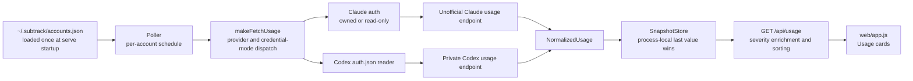
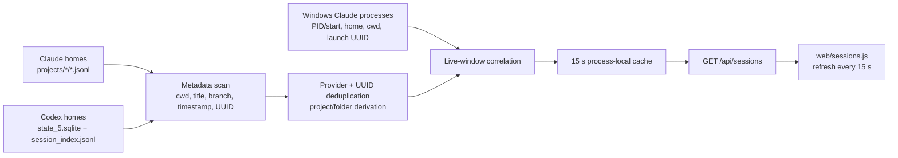
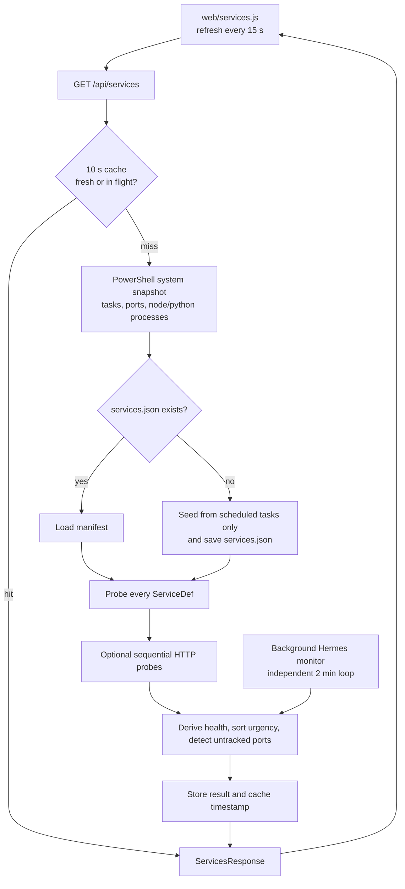
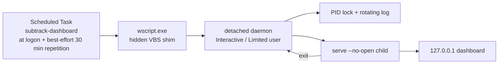

# subtrack architecture

This document describes the current working-tree implementation. Historical design notes are context, not a runtime contract; where they disagree, the source under `src/` and `web/` wins.

For the exact HTTP contract, see [HTTP API](api.md). Operational and trust-boundary details live in [Operations](operations.md), [Configuration](configuration.md), and [Security](security.md).

## Scope and boundaries

`subtrack` is one local web server with three independent surfaces:

- **Usage** polls Claude, Codex, and Grok account limits, normalizes them, and keeps the latest value per account in process memory.
- **Sessions** reads existing local Claude/Codex work-session metadata, deduplicates copies, and on Windows correlates live Claude processes with their account home and working directory.
- **Services** takes short-lived Windows system snapshots, compares them with a local service manifest, appends the latest independently collected Hermes fleet snapshot when configured, and exposes explicit Task Scheduler actions.

The production server binds plain HTTP to IPv4 loopback `127.0.0.1` only. It advertises `http://localhost:<port>` to the browser, but it is not a remote service, an authenticated multi-user service, or a stable public API. Loopback reduces exposure; it is not an authorization boundary against other processes or browser content running as the same user.

There is deliberately no subtrack-owned history database:

- `SnapshotStore` contains only the last Usage value per account and disappears when the process exits.
- Sessions reads provider-owned history from Claude JSONL files and Codex SQLite databases. It retains only process-local metadata/file caches and does not write a session database or persist transcript content.
- Normal Services inventory has a 10-second in-memory response cache. The optional Hermes monitor also persists bounded recovery counters, recent transitions, and a JSONL incident log; it does not store prompts or token values.
- The browser does not persist observations.
- `accounts.json`, `services.json`, optional `hermes.json`, Hermes monitor state, provider-owned session stores, credential homes, the daemon lock, and logs are durable provider/configuration/operational state, not usage/session measurement history.

## Usage data flow

The Poller owns scheduling and resilience; adapters own network calls and normalization. The Poller never imports a provider fetcher directly: `serve()` composes `makeFetchUsage()` and injects the resulting function through `PollerDeps.fetchUsage`.

### Normalized usage contract

`src/types.ts` is the cross-provider boundary. Every provider produces `NormalizedUsage`:

| Field | Meaning |
| --- | --- |
| `accountId`, `label` | Stable configuration identity and display label. Callers must keep the store key equal to `accountId` and keep account IDs unique. |
| `provider` | `claude`, `codex`, or `grok`. |
| `session` | Approximately five-hour window for Claude/Codex; for Grok this slot carries the grok-4 two-hour allowance. `null` when unknown. |
| `weekly` | Approximately seven-day window, or `null`. For Grok this is the weekly SuperGrok allowance from the advisory `GetGrokCreditsConfig` gRPC-Web call; `null` whenever that call fails. |
| `weeklyOpus` | Claude-only Opus weekly window, or `null`. |
| `fable` | Claude-only Fable weekly window, or `null`. |
| `fableAccess` | Whether Claude returned a Fable limit entry. This is independent of `fable`: `true` with a null window means access is known but the window was malformed or absent. Codex reports `false`. |
| `status` | `ok`, `throttled`, `auth_error`, `stale`, or `error`. |
| `lastUpdated` | ISO timestamp of the latest polling attempt, not necessarily the age of carried-forward windows. |
| `error` | Current attempt's diagnostic or `null`. |
| `retryAt` | Scheduled retry timestamp for throttling/auth pauses, otherwise normally `null`. |

A `UsageWindow` is `{ utilization, resetsAt }`. `utilization` is percent used. `resetsAt` is an ISO timestamp or `null`; adapters preserve null when the upstream response has not anchored a reset and never synthesize Unix epoch zero.

The HTTP layer adds `severity` to every non-null window:

- `ok`: utilization below 70.
- `warn`: utilization at least 70 and below 90.
- `crit`: utilization at least 90.

These thresholds are hard-coded and inclusive at 70 and 90. The implementation does not validate or clamp non-finite, negative, or greater-than-100 values before classification.

### Scheduling, retry, and carry-forward

Enabled accounts are initially staggered seven seconds apart. A five-second heartbeat checks which accounts are due, and due accounts are fetched sequentially. A running guard drops overlapping heartbeats. Stopping the Poller clears future heartbeats but does not cancel an in-flight request.

Normal provider TTLs come from configuration (defaults: Claude 180 seconds, Codex and Grok 60 seconds). Special scheduling is:

| Status | Next attempt | Backoff state | Last-known fields carried forward |
| --- | --- | --- | --- |
| `ok` | Provider TTL | Reset | No |
| `throttled` | 5, then 10, then 15 minutes (15 thereafter), or the provider's `Retry-After` when later, capped at 60 minutes | Increment | All four windows and `fableAccess` |
| `auth_error` | 15 minutes | Reset | All four windows and `fableAccess` |
| `stale` | Provider TTL | Reset | All four windows and `fableAccess` |
| `error` | Provider TTL | Reset | All four windows and `fableAccess` |

Carry-forward replaces only `session`, `weekly`, `weeklyOpus`, `fable`, and `fableAccess`. Status, error, attempt timestamp, and retry metadata remain those of the current attempt. With no prior snapshot, an initial failure remains an all-null card.

`SnapshotStore` is a mutable `Map<string, NormalizedUsage>`. A repeated key replaces its value while preserving key insertion order. `get()` and `all()` return shared object references; only the array returned by `all()` is new. There is no defensive copying, delete, TTL, eviction, persistence, or history.

The Usage API enriches a copy of each top-level record, then sorts by the largest utilization among `session`, `weekly`, and `fable`. `weeklyOpus` is not part of server sorting. Ties retain store order. The browser subsequently groups Claude, then Codex, then Grok, preserving that order within each provider, and its own “Tightest” summary does include Opus.

## Provider and credential lifecycles

Both usage integrations call observed, unofficial endpoints whose paths, headers, and response shapes may drift.

### Claude: owned credentials

An owned account normally uses `~/.subtrack/claude-homes/<id>/.credentials.json`, selected with `CLAUDE_CONFIG_DIR` during login. `ClaudeAuth`:

1. reads `claudeAiOauth` from the file;
2. returns a token that has more than 60 seconds remaining;
3. if a refresh token exists and expiry is within 60 seconds (or refresh is forced), verifies that the home is lexically inside the configured owned root;
4. posts a form-encoded refresh request to Anthropic;
5. merges the rotated token data into the credential JSON and writes the whole file back.

If the refresh response omits `expires_in`, the implementation assumes eight hours. If the credential has no refresh token, it returns the existing access token and lets the usage request prove validity. A Claude usage 401 causes one forced token acquisition and one additional usage request. A final 401 or 403 becomes `auth_error`.

Refresh tokens are single-use. Persistence is a direct, unlocked, non-atomic write after the server may have rotated the token; concurrent refresh, crash, or write failure can strand credentials. The owned-root check is lexical and refresh-only, not a realpath/reparse-point or read-access boundary.

### Claude: read-only credentials

Read-only mode is for an externally owned Claude CLI home or a static setup-token file. A separate token source rereads `.credentials.json` every poll and has no fetch-to-token-endpoint or file-write capability. A numeric expiry at or before the current clock produces `stale` without a usage request. A missing expiry is treated locally as usable until the provider rejects it. Only the external owner may refresh or replace these credentials.

### Codex

Codex login uses an isolated `CODEX_HOME`, normally `~/.subtrack/codex-homes/<id>`, and writes `auth.json`. Onboarding registers a new account only after the interactive child exits successfully and the file yields an access token. Repeating `add-account` for an existing Codex ID intentionally reruns login in the configured home, preserving its label and configuration. The reader also accepts the nested `providers.openai-codex` shape used by an explicitly configured external Hermes shared store. Subtrack rereads the access token and account ID for each poll, maps credential-read failures to `auth_error`, and has no Codex refresh or credential-persistence path.

### Grok

Grok has no CLI login. The credential is the browser session cookie for grok.com, pasted once by the operator into `~/.subtrack/grok-homes/<id>/cookie.txt`; the reader tolerates a BOM, a copied `Cookie:` prefix, and line wraps. `add-account` probes the live rate-limits endpoint before registering (a rejected cookie registers nothing) and stores the account as `credentialsMode: readonly`. There is no refresh or write path: an expired cookie surfaces as `auth_error` until re-copied. Registration also captures the account email into a non-secret `account.json` for labels and `list`.

### Provider normalization

- Claude maps `five_hour`, `seven_day`, and `seven_day_opus`; it finds Fable by exact `scope.model.display_name === "Fable"` inside `limits`. A present Fable entry establishes access even if its percent is unusable. A 2xx response with no windows still normalizes as `ok`.
- Codex inspects `rate_limit.primary_window` and `secondary_window`, classifying each by which reference duration it is nearer to: 18,000 seconds or 604,800 seconds. A 2xx body with no recognized window becomes `error`.
- Grok POSTs `{"requestKind":"DEFAULT","modelName":"grok-4"}` to `grok.com/rest/rate-limits` (verified live 2026-08-21) and maps `remainingQueries`/`totalQueries` to one session-slot window for the two-hour allowance; `resetsAt` is anchored only from an exhausted window's `waitTimeSeconds`. A 2xx body without those counters becomes `error`. HTTP 401 and 403 both map to `auth_error` (cookie rejected).
- All usage calls use a shared HTTP wrapper: at most three attempts by default, retrying transient transport failures and 5xx with 400/800 ms delays. It returns 4xx immediately. Claude's forced credential retry after 401 is an additional layer.

## Sessions data flow

Sessions does not use the Usage Poller, provider APIs, credentials, or `SnapshotStore`, and it has no mutation endpoint.

### Persistent-store discovery and metadata

Claude discovery includes the default `~/.claude`, immediate directories under `~/.claude-accounts` except obvious backup/old names, and configured Claude `credentialsHome` paths only when `credentialsMode` is `readonly`. Subtrack-owned Usage credential homes are intentionally excluded: they can contain probe transcripts but are not interactive work-session/resume targets. Discovered homes whose `projects/` resolves (via `realpath`) to the same physical directory — the cc-account homes are junctions to `~/.claude/projects` since 2026-07-17 — collapse to one store, preferring the home that physically owns the directory, so a shared store is scanned once and attributed to its owner rather than to an arbitrary alias. Only direct `projects/<encoded-cwd>/*.jsonl` files are candidates; nested session subagent directories are not promoted to top-level work sessions. The scanner reads bounded head/tail chunks and extracts only `cwd`, `customTitle` / `aiTitle` / `agentName`, `gitBranch`, timestamps, and the filename UUID into its response model. Transcript timestamps are the activity source, with filesystem mtime only as a fallback. A file without `cwd` is omitted as a non-resumable metadata stub.

Codex discovery includes `~/.codex` and configured Codex homes that contain `state_5.sqlite`. The database is opened read-only with Node's SQLite API, and only `threads` rows whose source is `vscode` or `cli` are included; execution/subagent noise is excluded. `session_index.jsonl` can override a database title. Codex rows preserve the database's archived flag, activity time, cwd, branch, and UUID.

Copies are deduplicated by provider plus UUID. Claude copies retain all available launcher names, while the preferred copy is a matching live launch or otherwise the newest non-archived/largest candidate. Project is the nearest `.git` directory name when found; Claude worktrees display their owning repository plus worktree name. Exact cwd remains separately available.

### Live Claude correlation and activity labels

On Windows, `src/sessions/windows.ts` inspects live `claude.exe` processes. Its PowerShell helper uses observed x64 PEB offsets to extract only the configured home and cwd needed for correlation, plus PID/start time; it parses a `--resume` / `-r` UUID from the process command line but does not return the complete command line or environment. The offsets are an observed machine contract, not a supported Windows API, so this part can fail independently.

Window bindings are intentionally qualified:

- `launch`: the UUID present in the launch command. It may be stale if the operator used `/clear` afterward.
- `likely`: no launch UUID existed, but exactly one transcript in the same home and cwd has activity at or shortly after process start.
- `ambiguous`: more than one candidate fits that correlation.
- `unknown`: no session UUID can be inferred.

A session is `open` only when it is tied to a live Claude window. Otherwise an archived Codex row is `archived`; a non-archived row active within the default 24 hours is `recent`; everything older is `idle`. In particular, `recent` is not evidence that a Codex desktop/CLI window is open. The implementation does not map a running Codex application to a selected thread.

Resume commands are generated as quoted PowerShell for copy-only use: Claude changes to the exact cwd and invokes the inferred account launcher with `--resume`; Codex sets the source `CODEX_HOME` and runs `codex resume -C`. The API does not execute either command.

Each store scan and live-window probe can add a warning. Any warning sets `partial: true` while successfully read stores remain in the response. Successful responses are cached for 15 seconds, and concurrent misses share one in-flight scan. Claude file metadata is also reused while size and mtime are unchanged. A failed top-level provider call is not installed as a successful cache entry. The HTTP route is GET-only and adds `Cache-Control: no-store` to every response; this browser-cache policy is independent of the process-local scan cache.

## Services data flow

Services does not use the Usage Poller or `SnapshotStore`.

On a cache miss, `gatherSystemState()` makes one hidden, non-interactive PowerShell call. It captures non-Microsoft scheduled tasks, listening ports below 50000 on loopback/wildcard addresses, and only `node.exe`, `python.exe`, and `pythonw.exe` processes with full command lines. PowerShell uses `SilentlyContinue`; a nonzero exit or invalid JSON becomes an empty snapshot, so acquisition failure can look like absence.

If `~/.subtrack/services.json` does not exist, the first snapshot seeds one `task` definition for each observed scheduled task. Contrary to the historical design, current seeding does not add ports or processes. Once the file exists it is loaded fresh on each cache rebuild. Its contents are cast to `ServiceDef` with little runtime validation.

Health probes are deterministic and injectable:

- `task`: exact task-name match; missing or disabled is `down`; a non-benign last result is `degraded`; optional port/process evidence can strengthen or degrade an always-on task.
- `port`: present in the captured listener list is `up`, otherwise `down`.
- `http`: 2xx is `up`; non-2xx with a listening port is `degraded`; non-2xx without one is `down`; timeout/transport/configuration failure is `unknown`.
- `process`: first case-insensitive regex match against process name or full command line is `up`; no match is `down`; missing or invalid regex is `unknown`.

Services are sorted with always-on entries first, then status rank `down`, `degraded`, `unknown`, `up`. Untracked detection emits listener ports not claimed by any definition; it guesses an owning process only when a captured command line contains `:<port>`. This is heuristic and often yields PID `-1`.

The provider cache defaults to ten seconds and coalesces simultaneous cache misses through one in-flight promise. `generatedAt` is captured at the start of a build, while cache age starts only after that build succeeds. A failed rebuild does not replace the cached value, but an expired previous value is not served stale; the next request attempts another build. The Services browser requests every 15 seconds without an overlap or response-sequence guard.

### Hermes fleet monitor

After the HTTP server successfully binds its exclusive loopback port, `serve` starts a separate Hermes background loop immediately and then at the configured interval (120 seconds by default). Starting after bind prevents a losing daemon/server contender from running canaries or recovery. The loop is not driven by `/api/services`; closing the browser does not stop checks or auto-heal. Failed initialization produces a sanitized `unknown` fleet row and a coalesced 60-second retry. Each cycle materializes configured expected profiles, auto-discovers additional installed gateways bound through `HERMES_CODEX_AUTH_FILE`, then validates:

- `gateway.pid` kind/PID/start time against a live profile-specific Python command, with duplicate matching processes reported;
- matching `gateway_state.json` with `gateway_state: running`;
- `platforms.telegram.state: connected` when the profile has Telegram configured (a CLI-only profile may require no platform);
- profile-to-canonical-store assignment, pinned account ID, refresh-token presence, and JWT account claim;
- a cached live request to the Codex usage endpoint and a periodic real-model canary through the configured representative Hermes profile.

Idle `gateway_state.updated_at` is not treated as a heartbeat. Process command lines are base64-wrapped inside the private PowerShell JSON so arbitrary control characters cannot corrupt the snapshot. Acquisition timeout, missing command metadata, stale PID/start metadata, duplicates, and conflicting identity become `unknown`/`degraded` evidence rather than restart permission. Auto-restart is limited to two consecutive confirmed missing-runtime observations, a cooldown, and an hourly cap; the reservation is atomically persisted before invoking `hermes --profile <id> gateway restart`. Restart has the same canonical-pin/JWT/refresh/exact-binding ownership gate as canary execution and is additionally suppressed while the public auth row is down. Auth rejection, account mismatch, unsafe profile/store binding, or corrupt monitor state never triggers restart, canary mutation, or login.

The latest snapshot is converted to public `kind: hermes` Services rows without credential paths, account IDs, tokens, command lines, or webhook URLs. Recovery/canary reservations, counters, and the last 50 sanitized events are written atomically to `~/.subtrack/hermes-monitor-state.json`; transitions append to `~/.subtrack/logs/hermes-monitor.jsonl`. Optional heartbeat/alert webhooks are best-effort and do not change local health.

## Module ownership and dependency-injection seams

| Module | Owns | Important injected seam |
| --- | --- | --- |
| `src/types.ts` | Shared Usage configuration and normalized contracts | None |
| `src/config.ts` | `accounts.json` defaults/load/save | Base home path |
| `src/poller.ts` | Due-account scheduling, backoff, carry-forward | Fetcher, store, clock, interval functions |
| `src/adapters/index.ts` | Provider and credential-mode dispatch | Auth readers, fetch, clock |
| `src/auth/*.ts` | Credential-file reads and Claude-owned rotation | Fetch and clock where relevant |
| `src/adapters/*.ts` | Provider requests, normalization, error mapping | Token/auth source and fetch |
| `src/snapshotStore.ts` | Last Usage value per account | None |
| `src/thresholds.ts` | Utilization-to-severity policy | None |
| `src/server.ts` | HTTP routing, static files, API enrichment/composition | Sessions/Services providers and action handler in `createApp()` |
| `src/sessions/types.ts` | Sessions, live-window, activity, and binding contracts | None |
| `src/sessions/scan.ts` | Store discovery, bounded metadata extraction, deduplication, activity/correlation, resume commands, cache | Base home, accounts, clock, PowerShell/live-window source, cache/recent thresholds |
| `src/sessions/windows.ts` | Minimal live Claude process metadata acquisition | `PwshRunner` |
| `src/ops/types.ts` | Authoritative Services, Windows snapshot, and action contracts | None |
| `src/ops/windows.ts` | PowerShell snapshot acquisition | `PwshRunner` |
| `src/ops/config.ts`, `seed.ts` | Service manifest persistence and first-run task seed | Base home and supplied snapshot |
| `src/ops/probe.ts`, `httpProbe.ts` | Pure health derivation and loopback HTTP check | System snapshot/fetch/clock inputs |
| `src/ops/services.ts` | Snapshot build, sorting, untracked derivation, cache | PowerShell runner, HTTP probe, clock, cache TTL |
| `src/ops/actions.ts` | Explicit Task Scheduler mutations | PowerShell runner, clock, base home |
| `src/hermes/config.ts` | Validated `hermes.json` loading | Base home |
| `src/hermes/probe.ts`, `windows.ts` | Profile discovery, PID/state/platform/auth checks, live auth probe | Filesystem, PowerShell, fetch, clock |
| `src/hermes/monitor.ts` | Background scheduling, canaries, hysteresis, safe restart, state/events/webhooks, public Services rows | Timers, filesystem, PowerShell, fetch, restart/canary commands |
| `src/hermes/supervisor.ts` | Post-bind initialization, visible failure row, and bounded initialization retry | Monitor factory, timer, clock |
| `web/app.js`, `web/sessions.js`, `web/services.js` | Browser rendering, local polling, copy controls, confirmations | Same-origin HTTP API |
| `src/install.ts`, `daemon.ts` | Windows startup registration and serve-child supervision | Base home; most process/system calls are concrete |

## Server, installer, and daemon topology

Foreground `serve` loads `accounts.json`, constructs the HTTP pipelines, binds the server, and only then initializes the optional Hermes monitor. Account edits require restart; a successfully initialized Hermes monitor also requires restart to adopt later configuration edits. A failed Hermes initialization is retried without stopping Usage/Sessions/Services. Provider-owned session files/databases and Services definitions are read on cache rebuilds and do not require a server restart.

On Windows, the always-on topology is:

The VBS shim exits immediately after starting the detached daemon, so Scheduled Task state is not the daemon's liveness state. The daemon first checks `/api/health`, then acquires an exclusive lock.

The 30-second live-PID rule in the current working tree is an **uncommitted daemon change**, not committed baseline behavior. With that dirty change, after health is down, a live lock PID is authoritative only while the lock is younger than 30 seconds; an older lock is removed without terminating its process. This can recover a wedged or recycled-PID lock, but it can also create overlapping supervisors when a legitimate startup takes longer than 30 seconds or the old daemon remains alive. The committed baseline stands down for any live lock PID regardless of lock age. See [Operations](operations.md#current-dirty-lock-takeover-behavior) before diagnosing or changing this path.

The daemon launches `node --import tsx src/cli.ts serve --no-open` and captures output in `~/.subtrack/logs/subtrack.log`. Rotation is one-deep and startup-only: before opening the log, a file already over 5 MiB is renamed to `.1`; it is not rotated continuously during the run. A short-lived child restarts after 2, 4, 8, 16, 32, then 60 seconds; a run lasting at least 30 seconds resets the delay. There is no periodic health check for a still-running child, so a live but wedged server depends on an external Scheduled Task launch and, in the dirty worktree, the lock-takeover rule above.

Single-instance detection trusts the minimal `200 {"ok":true}` health shape. An unrelated listener that returns that exact response can be mistaken for subtrack; an unrelated listener that merely owns the port makes `serve` fail its bind and enter daemon restart backoff.

Installation and actions use Windows Task Scheduler under the current user with `LogonType Interactive` and `RunLevel Limited`, never SYSTEM. Usage and persistent Sessions-store discovery can run elsewhere, but live Claude-window correlation, daemon installation, system snapshots, and service actions are Windows-specific.

## Security and privacy boundaries

- Usage access tokens are sent only to their respective providers, but they live in local JSON credential homes. These modules do not encrypt them, set restrictive ACLs, or use the otherwise separate keyring utility.
- Provider endpoints are private/unofficial implementation details and can change without notice.
- Sessions responses expose account labels, session titles/IDs, project/folder names, exact local paths, branches, PIDs, timestamps, and copyable resume commands. The scanner does not return prompt/message/tool content, full process command lines, or complete environments, but the metadata remains sensitive and the underlying provider stores remain on disk.
- Services responses and the UI expose captured process command lines. Command lines can contain tokens, paths, or other secrets.
- Service actions mutate Task Scheduler without authentication. Browser confirmation is UX only; a non-browser caller can omit `Origin` and call the action endpoint directly.
- The HTTP probe is intended for loopback but currently concatenates unvalidated `port` and `path`, and fetch follows redirects. A path beginning `@host` can change URL authority, and a redirect can leave loopback. Treat service definitions as trusted local configuration until this is fixed.
- Scheduled-task action identity uses task name without task path. Registration uses `-Force`, so sanitized-name collisions can replace another accessible task.

## Historical design only, not current behavior

The following material appears in design documents but is not implemented and must not be inferred from this architecture:

- a Projects view, project scanning/categorization, `ops.json`, cleanup previews, archive actions, or `/api/projects*` endpoints;
- the separate `ccwatch` interactive Claude-window watchdog, its state machine, recovery ladder, or account-switching automation;
- general-purpose notifications, trend storage, burn-rate history, or any subtrack-owned usage/session measurement database (optional Hermes transition webhooks/state are narrowly scoped operational data);
- service registration that persists a `ServiceDef`, starts the new task immediately, hides it, adds a repetition trigger, or reproduces a process's true working directory;
- a true restart sequence. The current action named `restart` only calls `Start-ScheduledTask`;
- per-item PowerShell timeouts, structured probe error details, audited action logs, idempotency controls, or authenticated action authorization;
- auto-seeding service definitions from listening ports or processes.

Those items require a source change before they can be documented as product behavior.
